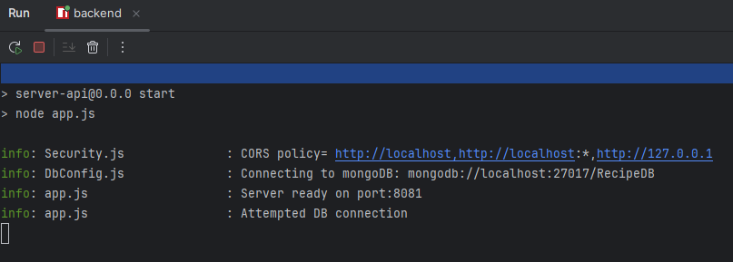
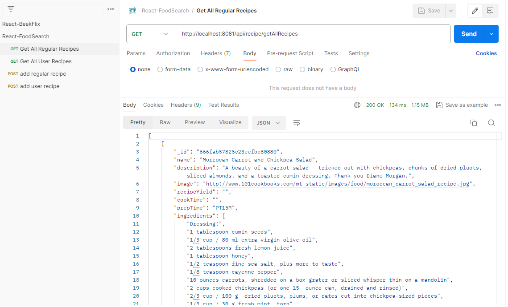
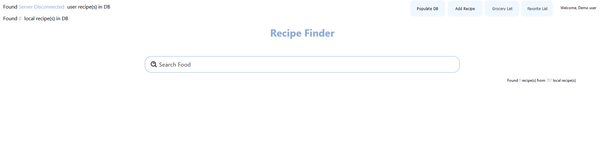
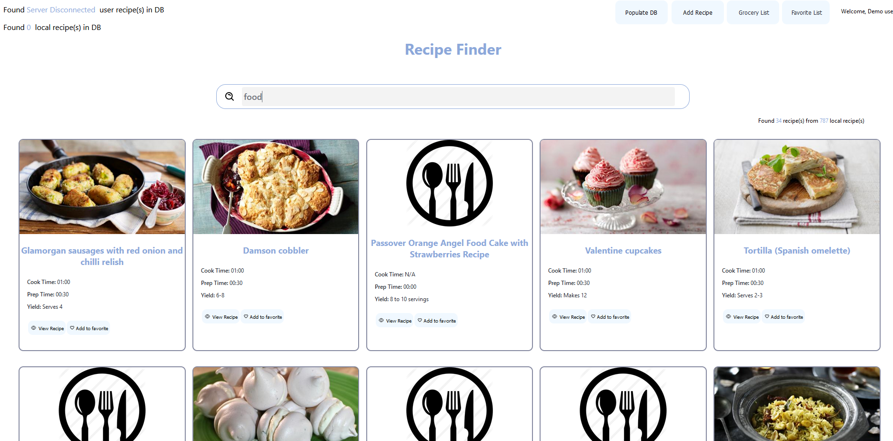
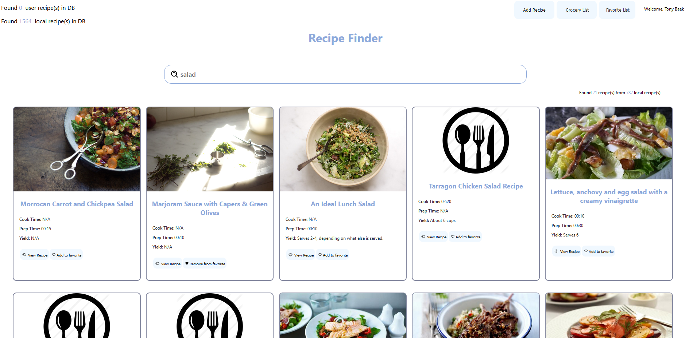
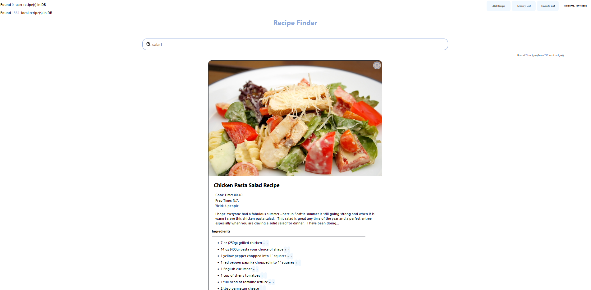
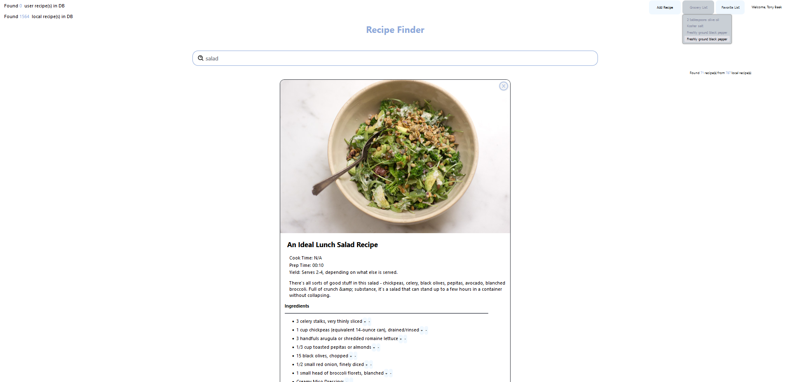

# FoodRecipeSearcher
A seperated repo from https://github.com/MarcoBackman/ReactProjects

## How to setup and run (server - backend)

> It's optional to run server application before running beakflix application.<br/>
> server application serves as backend REST API server while beakflix serves as a dynamic frontend application.

1. First, install Node.jS for react application

2. Second, install MongoDB environment locally or configure setup to connect to your mongoDB host.

   [Install mongoDB](https://www.mongodb.com/docs/manual/administration/install-community/)

3. Then setup configuration file.
    - add `config.json` file at the repository root path.
    - fill in every credentials labeled with `{}` in the following json content.
    - when you have authentication setup for mongo db set `"hasAuth" : true` otherwise `"hasAuth" : true`.
    - When you have ssl configured for http communication, set `"cookie" : { "ssl" : false }` to `true`.
    - If you need to make atlas db connection, set `isCloudDb` to `true` and put full url(including username, password, database) into `cloudDbFullUrl`
   ```json
   {
     "database": {
       "hasAuth" : false,
       "isCloudDb" : false,
       "cloudDbFullUrl" : "{YOUR_FULL_DB_URI}",
       "username" : "{YOUR_MONGODB_USERNAME}",
       "password" : "{YOUR_MONGODB_PW}",
       "host" : "{YOUR_MONGODB_HOST}",
       "port": "{YOUR_MONGODB_PORT}",
       "dbname" : "RecipeDB"
     },
     "server": {
       "corsWhiteList" : ["http://localhost", "http://localhost:*", "http://127.0.0.1"],
       "port": "{YOUR_DESIRED_EXPRESS_SERVER_PORT}"
     }
   }
   ```

4. Run server with following command under `.\MovieService\server\`
   ``` 
   npm install
   npm start
    ```
   

5. Import postman collection located at `reference/React-FoodSearch.postman_collection.json`
   
   
   
   or Run postman requests or use curl


## How to setup and run (food recipe - frontend)
1. Make sure you backend service is running with valid MongoDB connection

2. Navigate to `\FoodRecipeSearcher\frontend\` and modify `config.json` for you local server connection.
   For example, if you're running backend server in localhost:8081, you should put host as `localhost` and port as `8081`.
3. Also change proxy destination if you have changed the server host and port on backend server
`"proxy": "http://{YOUR_HOST}:{YOUR_PORT}"`

4. (Optional) Change frontend application port number. At the source root, navigate `.env` file and change to desired port number.
By default, it is 8082.

5. Make sure to change your proxy target if your server url and port is different. Go to `frontend/package.json` and change `"proxy": "http://localhost:8085`

6. At path `\FoodRecipeSearcher\frontend\` run following command.
   `npm install` then `npm start`

7. If your MongoDB is not set with the recipe data, you should click `populate to DB` to update database with local recipe data.

### How to use

1. Open following url in your browser `http://localhost:8082/` Then you will see the page looking like below.
   

2. You may independently run frontend app without server running. This case, the application will work with local data as shown below
   

3. Whenever you have backend server setup correctly, following will be shown.
   

   The DB data results will be shown at the top of the website
   
4. You may also click the buttons to see the available features.
   
   


## Things to improve in the future.
- Load favorite list from DB (currently, favorite feature is only for session)
- Optimize the search speed.
- Migration/deployment can be done with docker.